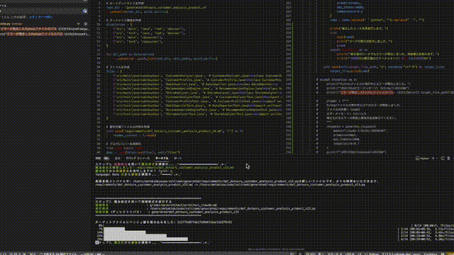

<h1>創造魔法 Zoltraak</h1>
<p>
Zoltraakは本格的な魔法時代の始まりを象徴する強大な創造魔法の名です。


これまでの未体系であった呪文からの術の発動を、魔法の文法体系に昇華しより高速かつ広範囲な術式展開と強大な魔法の発動を可能とするシステムです。

これは近い未来、一般魔法になるものです。

遠慮は要りません。


* Zoltraakの名はフリーレンの一般攻撃魔法Zoltraakから付けさせて頂いております。

</p>
<a href="https://twitter.com/ai_syacho" alt="Twitter Follow">
</a>
<a href="https://twitter.com/ai_syacho" alt="License"></a>
</p>

<!-- <p align="center">
<a href="https://github.com/dai-motoki/zoltraak" alt="GitHub contributors">
</a>
<a href="https://github.com/dai-motoki/zoltraak" alt="GitHub issues by-label">
</a> -->


## 最新リリース
0.1.27: ファイル執筆作成自動化




## 貢献者

<!-- ALL-CONTRIBUTORS-BADGE:START - Do not remove or modify this section -->
[](#contributors-)
<!-- ALL-CONTRIBUTORS-BADGE:END -->

<!-- ALL-CONTRIBUTORS-LIST:START - Do not remove or modify this section -->
<!-- prettier-ignore-start -->
<!-- markdownlint-disable -->
<table>
  <tbody>
    <tr>
      <td align="center" valign="top" width="14.28%"><a href="https://github.com/dai-motoki"><br /><sub><b>DAISUKE MOTOKI</b></sub></a><br /><a href="#code-dai-motoki" title="Code">💻</a></td>
      <td align="center" valign="top" width="14.28%"><a href="https://github.com/ThePioneerJP"><br /><sub><b>The Pioneer</b></sub></a><br /><a href="#code-ThePioneerJP" title="Code">💻</a></td>
      <td align="center" valign="top" width="14.28%"><a href="https://github.com/hiroki1014"><br /><sub><b>Hiroki Koshika</b></sub></a><br /><a href="#code-hiroki1014" title="Code">💻</a></td>
      <td align="center" valign="top" width="14.28%"><a href="https://github.com/UnagiTabetai"><br /><sub><b>MARUMO</b></sub></a><br /><a href="#code-UnagiTabetai" title="Code">💻</a></td>
      <td align="center" valign="top" width="14.28%"><a href="https://hamaruki.com/"><br /><sub><b>Maki</b></sub></a><br /><a href="#code-Sunwood-ai-labs" title="Code">💻</a></td>
      <td align="center" valign="top" width="14.28%"><a href="https://github.com/onikan27"><br /><sub><b>akino</b></sub></a><br /><a href="#code-onikan27" title="Code">💻</a></td>
      <td align="center" valign="top" width="14.28%"><a href="https://github.com/sarukun99"><br /><sub><b>tomoyuki enomoto</b></sub></a><br /><a href="#code-sarukun99" title="Code">💻</a></td>
    </tr>
    <tr>
      <td align="center" valign="top" width="14.28%"><a href="https://github.com/umayado17"><br /><sub><b>umayado17</b></sub></a><br /><a href="#code-umayado17" title="Code">💻</a></td>
      <td align="center" valign="top" width="14.28%"><a href="https://github.com/kinopeee"><br /><sub><b>kinopeee</b></sub></a><br /><a href="#code-kinopeee" title="Code">💻</a></td>
      <td align="center" valign="top" width="14.28%"><a href="https://github.com/Otori2501"><br /><sub><b>Otori</b></sub></a><br /><a href="#doc-Otori2501" title="Documentation">📖</a></td>
      <td align="center" valign="top" width="14.28%"><a href="https://t.co/qqv5Zts5V4"><br /><sub><b>tetumemo</b></sub></a><br /><a href="#doc-tetumemo" title="Documentation">📖</a></td>
      <td align="center" valign="top" width="14.28%"><a href="https://habatakurikei.com/"><br /><sub><b>Habatakurikei</b></sub></a><br /><a href="#code-Habatakurikei" title="Code">💻</a></td>
      <td align="center" valign="top" width="14.28%"><a href="https://github.com/lulu-hk"><br /><sub><b>Lulu Hiyokono</b></sub></a><br /><a href="#code-lulu-hk" title="Code">💻</a></td>
      <td align="center" valign="top" width="14.28%"><a href="https://github.com/zapabob"><br /><sub><b>峯岸　亮</b></sub></a><br /><a href="#code-zapabob" title="Code">💻</a></td>
    </tr>
    <tr>
      <td align="center" valign="top" width="14.28%"><a href="https://github.com/eieio81810"><br /><sub><b>Suzuki Yuto</b></sub></a><br /><a href="#tutorial-eieio81810" title="Tutorials">✅</a></td>
      <td align="center" valign="top" width="14.28%"><a href="https://github.com/astertechs-dev"><br /><sub><b>astertechs-dev</b></sub></a><br /><a href="#bug-astertechs-dev" title="Bug reports">🐛</a></td>
      <td align="center" valign="top" width="14.28%"><a href="https://speakerdeck.com/eltociear"><br /><sub><b>Ikko Eltociear Ashimine</b></sub></a><br /><a href="#doc-eltociear" title="Documentation">📖</a></td>
    </tr>
  </tbody>
</table>

<!-- markdownlint-restore -->
<!-- prettier-ignore-end -->

<!-- ALL-CONTRIBUTORS-LIST:END -->

コントリビューターの追加方法に関する詳細は以下のリンクを参照してください。
[コントリビューターの追加方法](#コントリビューターの追加方法)

Zoltraak は自然言語を実行言語に変換するプロンプトコンパイラシステムを採用し、数語の呪文から起動術式を用いて複雑な術式を展開しこれを即時実行可能な古代システム語へとコンパイルします。これにより術師の数語の呪文は強力な言霊の数々を織り込んだ魔法陣を通り魔法の範囲と威力を大幅に向上させることが可能となります。また詠唱、無詠唱での高速な創造魔法を実現可能とします。これにより相対する敵よりも圧倒的に高速かつ柔軟な術の発動を可能とします。

以下将来的に TODO:
独自言語呪文や暗号呪文へのコンパイルも可能とするため周りから呪文を抜き取られリバースエンジニアリングされる心配もありません。 微調整の後それを古代語として圧縮し呪文を秘匿する事も可能です。 また、独自言語を用い数語微修正するのみで、実行言語が瞬時に変わり術が発動します。

## ディストリビューション

- zoltraak-docker

https://github.com/Sunwood-ai-labs/zoltraak_docker

- Streamlit

https://x.com/habatakurikei/status/1784561693705560419

https://twitter.com/habatakurikei
https://twitter.com/habatakurikei

- hagging face

https://t.co/TlEq204NBG
https://x.com/hokazuya/status/1784887255154282524

## 他言語（Other languages）

他言語版 readme は以下からご覧になれます。現在サポートしているのは以下の言語です。

Readme files in other languages are available here. Currently we support:

- [English](README_EN.md)

# 目次

- [自然言語プログラミング文法](docs/NLProgramming_grammar.md)
- [研究](docs/research.md)
- [設定](docs/configuration.md)
- [FAQ](docs/faq.md)
- [始め方](docs/getting-started.md)
- [インストール](docs/installation.md)
- [使用方法](docs/usage.md)
- [例](docs/examples)
- [トラブルシューティング](docs/troubleshooting.md)
- [ビデオ](docs/video.md)
- [貢献](docs/contributing.md)

# Zoltraak の動作イメージ


# 利用方法

ビジネスサイドの方でも迷わないように、丁寧に記載します。

## Windows での利用方法

1. 事前準備

   1. Python のインストール

      [こちら](https://pythonlinks.python.jp/ja/index.html)のリンク（非公式）から、windows 用インストーラをダウンロードして、Python3 をインストールします。

   2. ANTHROPIC_API_KEY の取得

      [こちら](https://console.anthropic.com/)で ANTHROPIC のアカウントを作成し、Get API Keys より API KEY をコピーして保存しておきます。
      **絶対に誰にも見られないように管理しましょう。勝手に課金され放題になってしまいます。**

   3. ワークスペースフォルダの作成

      ユーザ配下に「workspace」など、任意の名前の専用フォルダを作っておくと、既存のファイルと混ざらずに管理しやすくなります。
      ここでは、以下のようなフォルダを作成しておきます。

      ```
      C:/Users/{ユーザ名}/workspace
      ```

      自分で別の名前を命名した場合、以下においては`workspace`を自分のつけた名前で読み替えてください。

   4. テキストエディタの立ち上げ

      コマンドプロンプトや Powershell でも構いませんし、vscoede などを入れても構いません。以下、ターミナルと呼びます。
      次項では、このターミナルに呪文を打ち込んで、`Enter`を押下していきます。

2. 詠唱

   基本的には何も考えずに、以下の順番でコマンドを入力すればよいです。

   1. ワークスペースへ移動
      ```
      cd C:/Users/{ユーザ名}/workspace
      ```
      `cd`とは「チェンジディレクトリ」の略で、ターミナルが指定したパスに移動してくれます。
      つまり移動先の中でターミナルが動くよ、ということです。
   2. 仮想環境を構築

      ```
      python -m venv .venv
      ```

      ターミナルが今いるフォルダ内に、仮想環境となるフォルダを作ってくれるコマンドです。

      最後の`.venv`は任意のフォルダ名でも構いません。自分で名付けた場合、以下の手順についても`.venv`を自分のつけた名前に読み替えてください。

      この中身が仮想環境となり、既存環境から切り離して`Zoltraak`を扱えるようになります。

   3. 仮想環境の有効化

      ```
      .venv\scripts\activate
      ```

      こうするとターミナルの左側に`（.venv）`と表示されるかと思います。

      そうなっている場合、ターミナルが仮想環境に対して動作していることを意味しています。

      なお、解除には`deactivate`と打てばよいです。

   4. Zoltraak のインストール

      ```
      pip install zoltraak
      ```

      しばらく時間がかかります。`.venv`内を開くといくつものフォルダが作られていることがわかります。
      特に、魔導書の根幹となるファイルたちは、以下のパスに保存されています。

      ```
      C:\Users\{ユーザ名}\workspace\.venv\Lib\site-packages\zoltraak\grimoires
      ```

      この中身は、この README 下部の「魔導書構成」で示されていますのでそちらを参照のこと。

   5. `.env`ファイルの作成

      エクスプローラ（黄色いフォルダのやつ）を開いて、`C:/Users/{ユーザ名}/workspace/.venv/Lib/site-packages/zoltraak`を開きます。

      ここに「右クリック>>新規作成>>テキストドキュメント」から、テキストファイルを作成します。
      =>作成したら、ファイル名を`.env`に変更します。
      それから、ファイルを開いて、1 行目に以下のように入力して保存します。

      ```
      ANTHROPIC_API_KEY=ここにAnthropicから取得したキー
      ```

      ※本当はコマンドでも作成できますが、文字コードというのを合わせるなどが必要なので、現状は非エンジニアは手動で作成したほうが簡単のようです。

   6. 詠唱

      以上で準備は整いました。以下のように、`zoltraak`コマンドに続けて"プロンプト"と起動式（プロンプトコンパイラ）を指定します。

      ```
      zoltraak "プロンプト内容" -c コンパイラ名
      ```

      コンパイラ名、プロンプト内容の例については、次項以降にて示します。

      これにより、入力したプロンプトに基づいた要件定義書が生成されます。生成された要件定義書は叩き台となるため、必要に応じて内容を修正・拡充してください。
      生成された要件定義書は、以下のフォルダに格納されます。

      ```
      C:\Users\{ユーザ名}\workspace\generated\requirements
      C:\Users\{ユーザ名}\workspace\requirements
      ```

3. プロンプトコンパイラ（起動式）の指定
   `-c` オプション以降は用途に応じて変更できるプロンプトコンパイラ（起動式）を指定します。指定なしの場合は、最も適切と思われるプロンプトコンパイラを 5 つ自動でピックアップするコンパイラが実行されます。

   | コンパイラ名      | 説明                                                                         |
   | ----------------- | ---------------------------------------------------------------------------- |
   | dev_func          | 関数型プログラミングを用いた開発タスクに関する要件定義書を生成するコンパイラ |
   | dev_obj           | オブジェクト指向設計を用いた開発タスクに関する要件定義書を生成するコンパイラ |
   | biz_consult       | ビジネスコンサルティングに関するドキュメントを生成するコンパイラ             |
   | general_def       | 一般的な開発タスクに関する要件定義書を生成するコンパイラ                     |
   | general_reqdef    | 一般的な要求事項に関する要件定義書を生成するコンパイラ                       |
   | dev_react_fastapi | React + FastAPI を用いた開発タスクに関する要件定義書を生成するコンパイラ     |

4. 具体例

   ```sh
   zoltraak "Manimを用いて、MoE（専門家の混合）モデルを視覚化するプログラムを開発する" -c dev_func
   zoltraak "今月中にオブジェクト指向設計を用いて、多機能在庫管理システムを開発する" -c dev_obj
   zoltraak "今月中に中小企業向けのビジネスコンサルティングドキュメントを作成する。具体的には、マーケティング戦略、財務管理、人材育成に関するアドバイスを含む" -c biz_consult
   zoltraak "今月中に教育用の拡張現実（AR）アプリケーションを開発する" -c general_def
   zoltraak "今月中に政府向けの少子化対策として、具体的な施策と予算案を含む提言書を執筆する" -c general_reqdef
   ```

5. `test_dev_obj.md`というファイルを作成し、後続スレッドの内容をコピーして貼り付けてください。このファイルを zoltraak を実行するディレクトリと同じ階層に配置します。

6. `test_dev_obj.md`を以下のルールに従って自分の定義書生成プログラムに書き換えましょう:

   - `{prompt}`は zoltraak の後のプロンプト（呪文）が入るので消さないでください。
   - `## 2. ファイル・フォルダ構成`も消さないでください。
   - それ以外は自由に変更可能です。

7. 以下のコマンドを実行して、自作コンパイラを使用します:

   ```sh
   zoltraak プロンプト -cc 自作コンパイラ
   zoltraak "コーヒーショップ顧客管理システムを作りたい" -cc test_dev_obj.md
   ```

8. `zoltraak requirements/~~~.md`が貼り付けできるようになっているはずなので実行してください。

9. ディレクトリが構築されます。Cursor、VSCode にて open コマンドが起動しない方は以下を参照してください:
   https://note.com/88gram/n/n4ead3a677b83

注意: 全て Claude3 Haiku により実行されています（一回あたり約 1 円の料金がかかります。ご自身で確認ください）。

```
zoltraak book.md -p "本を書きたい"
```

ファイル作成後は以下のように何度でも書き換えることができる。

```
zoltraak book.md -p "もっと分量増やしたい"
```

```sh
# RAGに突っ込むファイル群を指定
zoltraak aaaa.md -f ./input.md （作成予定）
# 一括修正
zoltraak dir/*.md （作成予定）
```


### オプショナル引数

- `-f` : フォーマット指定。grimoires フォルダ
- `-l` : 汎用言語指定。言語名は、"Español"などの現地名でも、"Spanish"のような英語でも、「スペイン語」のような日本語でも OK です。
  - 指定フォーマットについて、汎用言語フォーマッター（"`_lang.md`"で終わるファイル）が存在する場合は、そのファイルに基づき処理されます。
  - 存在しない場合は、デフォルトの言語セットコンパイラが起動します。ただ、相対的に効果がやや不安定なので、汎用言語フォーマッターを作成しておくことが強く推奨されます。

```
zoltraak "今月中にオブジェクト指向設計を用いて、多機能在庫管理システムを開発する" -c dev_obj -l English
zoltraak "今月中にオブジェクト指向設計を用いて、多機能在庫管理システムを開発する" -c dev_obj -f md_comment -l CSharp
zoltraak "今月中にオブジェクト指向設計を用いて、多機能在庫管理システムを開発する" -c dev_obj -l グルジア語
```

## プロジェクトへの参加

1. リポジトリをクローンします:

   ```
   git clone https://github.com/dai-motoki/zoltraak.git
   ```

2. プロジェクトディレクトリに移動します:

   ```
   cd zoltraak
   ```

3. 仮想環境の作成
   まず、パッケージ開発用の独立した仮想環境を作成します。これにより、システム全体の Python とは分離された環境で開発できます。

```bash
python -m venv zoltraak-dev
source zoltraak-dev/bin/activate  # Linuxの場合
zoltraak-env\Scripts\activate.bat  # Windowsの場合
```

4. 必要なパッケージのインストール
   開発に必要な依存パッケージをインストールします。例えば、`setuptools`と`wheel`は最低限必要です。

```bash
pip install setuptools wheel
```

5. パッケージのインストール
   開発中のパッケージを仮想環境にインストールします。

```bash
pip install -e .
```

これで、仮想環境内でパッケージを使用したり、変更を加えたりできるようになります。

4. Anthropic API キーを設定します:
   - プロジェクトのルートディレクトリに`.env`ファイルを作成します。
   - 以下の行を`.env`ファイルに追加し、`YOUR_API_KEY`を実際の Anthropic の API キーに置き換えます:
     ```
     ANTHROPIC_API_KEY=YOUR_API_KEY
     ```

### 追加コマンド（以下はオーナーのみ）

update_and_upload.sh

```sh

echo "バージョンをアップデート中..."
python update_version.py

echo "パッケージをビルド中..."
python setup.py sdist bdist_wheel

echo "ビルドしたパッケージをPyPIにアップロード中..."
twine upload dist/*
```

## 魔導書構成

```
zoltraak/grimoires/
├── compiler: 詠唱から自然言語への変換器
│   ├── akirapp.md
│   ├── func.md
│   ├── lisp.md
│   ├── obj.md
│   ├── obj_mermaid.md
│   ├── obj_lisp.md
│   ├── obj_lisp_g.md
│   ├── obj_lisp_g_base64.md
│   └── reqdef.md
├── encryption: 暗号化ツール
│   └── emoji.md
├── formatter: プロンプトフォーマッタ
│   ├── md_comment.md
│   ├── md_comment_xx.md (md_commentの言語指定：en, zhなどに対応。ご利用の言語の略称でまずは動くか確認して、動かない場合は追加対応をお待ちください)
│   └── py_comment.md
├── interpretspec: インタプリタ型LLM強化プロンプト
│   └── hirokichi.md
└── softdb: 柔らかいDB


memo: grimoires内の全てのベンチマークは各々やるような実験システムもいれたい

```

## 使用方法

Markdown ファイルを Python コードに変換するには、以下のコマンドを使用します。

はい、以下に英語の README を日本語に翻訳しました。

## キャッシング

Zoltraak は、変更されていない Markdown ファイルの不要な変換を避けるために、キャッシングメカニズムを実装しています。各 Markdown ファイルのハッシュ値を計算し、`hashes.txt`ファイルに保存します。変換コマンドを実行すると、Zoltraak は現在のハッシュ値を保存されているものと比較します。ハッシュ値が一致する場合、Markdown ファイルが変更されていないことを示しているため、変換はスキップされ、以前に生成された Python コードが使用されます。

## CI/CD との統合

Zoltraak は CI/CD ワークフローに統合して、変換プロセスを自動化することができます。`run_tests.sh`スクリプトは、この統合を容易にするために提供されています。以下の手順を実行します。

1. 仮想環境を作成し、アクティベートします。

2. 必要な依存関係をインストールします。

3. Markdown ファイルを Python コードに変換します。

4. 生成された Python コードを実行します。

5. 対応するユニットテストを実行します。

`run_tests.sh`スクリプトを CI/CD パイプラインで使用するには、CI/CD システムがビルドプロセスの一部としてスクリプトを実行するように設定してください。

## 貢献

コントリビューションを歓迎します！問題を見つけた場合や改善の提案がある場合は、issue を開くかプルリクエストを送信してください。

## ライセンス

## TODO

### 急ぎ

- [ ] https://x.com/ai_syacho/status/1782956863912649114
- [ ] zoltraak "slkajfka" -c ファイルパス（これで自作もいける様にする）

```
ModuleNotFoundError系は
pip install ~~~~
で解決されます。

今回は
pip install anthropic
を行うことで解決されます。

↓
pip install zoltraak
一発で依存関係全て入る様に調整します。
```

### CLI コマンド関連

- [ ] zoltraak -p "manim 動画を作りたい" これで要件定義書とプログラムが生成

  -

### ドキュメント生成

- [ ] 出力された Python ファイルと詳細設計書のドキュメントを欲しい。
  - python ファイルからドキュメントを生成したい
    - 例: `Zoltraakgenerated/calc.py` のように python ファイルを指定すると、そのファイルに対応するマークダウンドキュメントを生成、更新できるようにする
    - python ファイルの docstring やコメントからドキュメントを自動生成する
    - 生成されたドキュメントはマークダウン形式で出力する

### テスト

- [ ] テストファイルは別途作成し、必要なタイミングで git push などによりテストが実行されるようにしたい。

### Issue 管理

- [ ] issue を記述したい。

### ファイル管理

- [x] 繰り返し利用する場合は、Markdown ファイルと Python ファイルを自動的に紐付けたい。（変更がある場合のみ再コンパイル）

### 要件定義関連

- [ ] 読み上げ文章から要件定義書を生成するプログラムをあきらさんのプロジェクトで実装する。
  - 宣言型と手続き型はごちゃっと入れた方が良さそう
- [ ] ZoltraakAAA.md 〜したい で定義書を修正
- [ ] あると嬉しいのは要件定義を決める際のプロンプトドキュメント
  - コンパイラファイルは選択したい
- [ ] プログラムから要件定義に戻すフローが必要。

### その他

- [ ] 各種高級言語の変な癖を解消するための中間ファイルを事前に用意しておくのがよい。
- [ ] このファイルで、色合いに相当する部分のプロンプトの行数を教えて
- [ ] 差分をプロンプトとして伝達したい。
- [ ] 全て１から作り直す。md ファイルから
      

## 全体の流れ

- ① 曖昧で抽象的：初期のプロンプトがこれに相当。「ほにゃらしたい」という曖昧な要求。

shell

```
zoltraak "本書きたい"
```

↓

md ファイル
gen*def*{goal}.md

```
# ゴール: 本を書きたい
要件定義書:
{def}
```

↓

- ② 厳密で抽象的：要件定義書など。プロンプトから定義書を作成することで曖昧さが排除され、抽象的な状態になる。
  def\_{goal}.md

```
書籍執筆要件定義書:
import {def}
import {def}
import {def}

~~~~~~~
~~~~~~~
~~~~~~~
~~~~~~~
~~~~~~~
```

↓

- ③ 曖昧で具体的：具体的な行動は伴っているが、まだ試行錯誤している段階。対話型（インタプリタ）とも言える。
  exe\_{goal}.py

```
プログラム # コメント
プログラム # コメント
プログラム # コメント
プログラム # コメント
```

- ④ 厳密で具体的：1 本の具体的な行動に落とし込まれており、マニュアル化（ドキュメント型、コンパイル）された状態。

exe\_{goal}.md

```
詳細手順書（暗号化、抽象化、使い手がわかりやすい状態にする。[]

```

zoltraak book.md

### 自然言語プログラミングの系譜

```
*ChatGPT登場
    |→ プロンプトエンジニアリング
        *プロンプトのシステム開発適用の必要性
            |→ プロンプトプログラミング
                * Claude3 Opusの出現
                |→ ドキュメントプログラミング
                    |→ 自然言語プログラミング
                            motoki → arbor → zoltraak
                                        * Groq x Llama3の対話不可能な高速テキスト出力制御
                                                |→ 自然言語フレームワーク zoltraak
                                                |→ プログラミング統一言語 babel
                                                                        ↑ イマココ
```

### アップロードの仕方

PyPI にパッケージをアップロードする手順は以下の通りです。

1. パッケージの準備:

   - プロジェクトのディレクトリ構成を適切に設定します。
   - [setup.py](file:///Users/motokidaisuke/motoki/setup.py#1%2C1-1%2C1)ファイルを作成し、パッケージの情報（名前、バージョン、依存関係など）を記述します。
   - [README.md](file:///Users/motokidaisuke/motoki/README.md#1%2C1-1%2C1)ファイルを作成し、パッケージの説明や使用方法を記載します。

2. アカウントの作成と API トークンの取得:

   - PyPI の Web サイト（ https://pypi.org/ ）にアクセスします。
   - 新しいアカウントを作成するか、既存のアカウントにログインします。
   - アカウントの設定ページで、API トークンを生成します。

3. ビルドとアップロード用ツールのインストール:

   - `twine`と`setuptools`をインストールします。
     ```
     pip install twine setuptools
     ```

4. パッケージのビルド:

   - プロジェクトのルートディレクトリで以下のコマンドを実行し、パッケージをビルドします。
     ```
     python setup.py sdist bdist_wheel
     ```
   - これにより、`dist`ディレクトリにパッケージの配布用ファイルが生成されます。

5. PyPI へのアップロード:

   - 以下のコマンドを実行し、パッケージを PyPI にアップロードします。
     ```
     twine upload dist/*
     ```
   - ユーザー名とパスワードの代わりに、取得した API トークンを使用します。

6. アップロードの確認:
   - PyPI の Web サイトにアクセスし、アップロードしたパッケージが正しく表示されていることを確認します。

これで、`zoltraak`パッケージが PyPI に公開されました。ユーザーは`pip install zoltraak`コマンドを使用してパッケージをインストールできます。

注意点:

- パッケージ名は一意である必要があります。既に存在する名前は使用できません。
- バージョン番号は、新しいバージョンをアップロードするたびに増やす必要があります。
- `setup.py`ファイルには、適切なメタデータと依存関係を記述してください。
- `README.md`ファイルには、パッケージの説明や使用方法を明確に記載してください。

以上が、PyPI へのパッケージのアップロード手順です。問題がある場合は、PyPI のドキュメンテーションを参照するか、コミュニティに質問してください。

## 仮想環境を用いて実行

`pyenv` は Python のバージョン管理ツールですが、直接的に仮想環境を作成する機能は持っていません。仮想環境を作成するためには、`pyenv-virtualenv` というプラグインを使用する必要があります。

以下は `pyenv-virtualenv` を使用して仮想環境を作成する手順です。

1. **pyenv-virtualenv のインストール**

   まずは `pyenv-virtualenv` プラグインをインストールします。これは `pyenv` が既にインストールされていることを前提としています。

   ```bash
   git clone https://github.com/pyenv/pyenv-virtualenv.git $(pyenv root)/plugins/pyenv-virtualenv
   ```

   インストール後、シェルの設定ファイル (例えば `.bashrc` や `.zshrc`) に以下を追加して、シェルを再起動します。

   ```bash
   eval "$(pyenv init --path)"
   eval "$(pyenv virtualenv-init -)"
   ```

2. **Python のインストール**

   `pyenv` を使用して、仮想環境用の Python バージョンをインストールします。

   ```bash
   pyenv install 3.8.5  # 例として Python 3.8.5 をインストール
   ```

3. **仮想環境の作成**

   次に、指定した Python バージョンで仮想環境を作成します。

   ```bash
   pyenv virtualenv 3.8.5 my-virtual-env-3.8.5
   ```

   ここで `my-virtual-env-3.8.5` は仮想環境の名前です。

4. **仮想環境のアクティベーション**

   作成した仮想環境をアクティブにします。

   ```bash
   pyenv activate my-virtual-env-3.8.5
   ```

   これで、指定した仮想環境がアクティブになります。

5. **仮想環境のデアクティベーション**

   仮想環境をデアクティブにするには、以下のコマンドを使用します。

   ```bash
   pyenv deactivate
   ```

これで `pyenv` と `pyenv-virtualenv` を使用して Python の仮想環境を作成し、管理する方法を説明しました。

ローカル環境

pip install -e .

を行うと
Users/motokidaisuke/.pyenv/versions/3.11.5
に入ってしまうらしい

python setup.py sdist bdist_wheel
twine upload --verbose dist/\*

仮想環境
deactivate
rm -rf /Users/motokidaisuke/aaaaa/zoltraak-env
python3 -m venv /Users/motokidaisuke/aaaaa/zoltraak-env
source /Users/motokidaisuke/aaaaa/zoltraak-env/bin/activate

# アイデア（重要）

呪文 → 文書 → 構造体 → 情報構造体 → 実行
|→ 自然言語 |→ 自然言語
|→ プログラミング言語

# メモ

```

import compiler.dev.obj
import writer.book.lecture

```

# TODO

- [ ] ディレクトリ構築はペーストではなくシステムから構築するか聞かれるようにする
- [ ] Python のファイル取得部は関数化して外部ファイル化ける
- [ ] デザイナーと開発者を導入。

# 0.1.25 更新情報

2024_04_28

- setting → grimoires に変更
- react & fast API の要件定義書を記載しディレクトリを構築する dev_react_fast_api を追加
- formatter 25 パターンほど追加
- 実行フローを整理、アニメーション追加

# チップス

zoltraak "かぞく情報データ分析 v4" -c dev_react_fastapi

とやると要件定義書名にバージョンを記載してくれる。

## コントリビューターの追加方法

コントリビューターを追加するには、以下の手順を実行してください:

1. issue またはプルリクエストに、以下の形式でコメントを残してください:

```
@all-contributors please add @username for <contributions>
```

`@username`をコントリビューターの GitHub ユーザー名に、`<contributions>`をコントリビュートのタイプに置き換えてください。コントリビュートのタイプは、[Emoji Key](https://allcontributors.org/docs/en/emoji-key)を参照してください。

2. ボットがコントリビューターをプロジェクトに追加するためのプルリクエストを作成します。

3. プルリクエストがマージされると、コントリビューターが README に追加されます。

# 超大事なことメモ

起動式にグリモワを全部詰め込む！！！！
忘れないように
