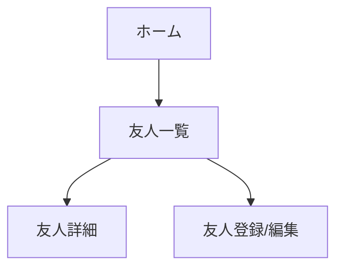

# ともだち管理システムの要件定義書

## 1. 目的
本システムは、ユーザーが友人を管理し、友人情報を共有できるアプリケーションを提供することを目的としている。ユーザーは友人の基本情報の登録、編集、削除を行うことができ、友人の連絡先や誕生日などの情報を一元的に管理できる。また、ユーザー間で友人情報を共有することで、友人関係の維持や新しい出会いの創出を支援する。

## 2. ファイル・フォルダ構成

### フロントエンド(React)
```
my-app/
├── src/
│   ├── components/
│   │   ├── Header.js
│   │   ├── FriendList.js
│   │   ├── FriendDetail.js
│   │   ├── FriendForm.js
│   │   └── Shared.js
│   ├── pages/
│   │   ├── HomePage.js
│   │   ├── FriendListPage.js
│   │   └── FriendDetailPage.js
│   ├── services/
│   │   └── api.js
│   ├── styles/
│   │   └── global.css
│   ├── utils/
│   │   └── helpers.js
│   ├── App.js
│   └── index.js
├── public/
│   ├── index.html
│   └── favicon.ico
├── package.json
└── README.md
```

### バックエンド(FastAPI)
```
backend/
├── app/
│   ├── models/
│   │   ├── friend.py
│   │   └── user.py
│   ├── schemas/
│   │   ├── friend.py
│   │   └── user.py
│   ├── routers/
│   │   ├── friends.py
│   │   └── users.py
│   ├── database.py
│   ├── main.py
│   └── utils.py
├── tests/
│   ├── test_friends.py
│   └── test_users.py
├── requirements.txt
└── README.md
```

## 3. APIエンドポイント

| HTTP メソッド | パス | 説明 |
| --- | --- | --- |
| GET | /friends | 全ての友人情報を取得 |
| GET | /friends/{friend_id} | 指定したIDの友人情報を取得 |
| POST | /friends | 新しい友人情報を作成 |
| PUT | /friends/{friend_id} | 指定したIDの友人情報を更新 |
| DELETE | /friends/{friend_id} | 指定したIDの友人情報を削除 |
| GET | /users | 全てのユーザー情報を取得 |
| GET | /users/{user_id} | 指定したIDのユーザー情報を取得 |
| POST | /users | 新しいユーザー情報を作成 |
| PUT | /users/{user_id} | 指定したIDのユーザー情報を更新 |
| DELETE | /users/{user_id} | 指定したIDのユーザー情報を削除 |

## 4. データモデル

### Friend
- id: UUID
- name: str
- email: str
- phone: str
- birthday: date
- user_id: UUID (ユーザーとの1対多のリレーション)

### User
- id: UUID
- username: str
- email: str
- password_hash: str
- friends: List[Friend] (ユーザーと友人の多対多のリレーション)

## 5. Reactコンポーネント

### Header
- 役割: アプリケーションのヘッダーを表示
- props: なし
- state: なし

### FriendList
- 役割: 友人の一覧を表示
- props: friends: List[Friend]
- state: selectedFriend: Friend | null

### FriendDetail
- 役割: 選択した友人の詳細情報を表示
- props: friend: Friend
- state: なし

### FriendForm
- 役割: 友人情報の登録/編集フォームを表示
- props: friend: Friend | null, onSubmit: (friend: Friend) => void
- state: name: str, email: str, phone: str, birthday: date

### Shared
- 役割: アプリケーション全体で共有される機能を提供
- props: なし
- state: なし

## 6. ユーザーインターフェース

### 画面遷移図


### ワイヤーフレーム
1. ホーム画面
   - 友人一覧へのリンク
   - 新規友人登録ボタン

2. 友人一覧画面
   - 友人の一覧表示
   - 友人の詳細表示リンク
   - 友人の編集/削除ボタン

3. 友人詳細画面
   - 選択した友人の詳細情報表示
   - 友人情報の編集ボタン

4. 友人登録/編集画面
   - 友人情報の入力フォーム
   - 登録/更新ボタン