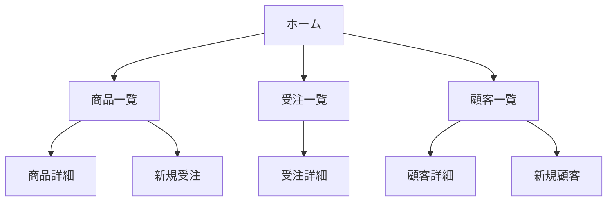

# React + FastAPI アプリケーションの要件定義書
## ゴール: とけいショップの管理システム

## 1. 目的
本システムは、時計ショップの在庫管理、受注管理、顧客管理を行うことを目的としている。店舗担当者は、本システムを使って時計の在庫状況の確認、新規受注の登録、顧客情報の管理などを行うことができる。

## 2. ファイル・フォルダ構成

### フロントエンド(React)
```
react-app/
├── src/
│   ├── components/
│   │   ├── Header.js
│   │   ├── Footer.js
│   │   ├── ProductList.js
│   │   ├── ProductDetail.js
│   │   ├── OrderForm.js
│   │   ├── CustomerList.js
│   │   └── CustomerDetail.js
│   ├── pages/
│   │   ├── Home.js
│   │   ├── Products.js
│   │   ├── Orders.js
│   │   └── Customers.js
│   ├── utils/
│   │   ├── api.js
│   │   └── helpers.js
│   ├── styles/
│   │   └── global.css
│   ├── App.js
│   └── index.js
├── package.json
└── README.md
```

### バックエンド(FastAPI)
```
fastapi-app/
├── app/
│   ├── models/
│   │   ├── product.py
│   │   ├── order.py
│   │   └── customer.py
│   ├── schemas/
│   │   ├── product.py
│   │   ├── order.py
│   │   └── customer.py
│   ├── routers/
│   │   ├── products.py
│   │   ├── orders.py
│   │   └── customers.py
│   ├── database.py
│   ├── main.py
│   └── dependencies.py
├── tests/
│   ├── test_products.py
│   ├── test_orders.py
│   └── test_customers.py
├── requirements.txt
└── README.md
```

## 3. APIエンドポイント

### 商品管理
- GET /products - 商品一覧の取得
- GET /products/{product_id} - 商品詳細の取得
- POST /products - 新規商品の登録
- PUT /products/{product_id} - 商品情報の更新
- DELETE /products/{product_id} - 商品の削除

### 受注管理
- GET /orders - 受注一覧の取得
- GET /orders/{order_id} - 受注詳細の取得
- POST /orders - 新規受注の登録
- PUT /orders/{order_id} - 受注情報の更新
- DELETE /orders/{order_id} - 受注の削除

### 顧客管理
- GET /customers - 顧客一覧の取得
- GET /customers/{customer_id} - 顧客詳細の取得
- POST /customers - 新規顧客の登録
- PUT /customers/{customer_id} - 顧客情報の更新
- DELETE /customers/{customer_id} - 顧客の削除

## 4. データモデル

### Product
- id: int
- name: str
- description: str
- price: float
- stock: int

### Order
- id: int
- customer_id: int
- product_id: int
- quantity: int
- order_date: datetime
- status: str

### Customer
- id: int
- name: str
- email: str
- phone: str
- address: str

## 5. Reactコンポーネント

### Header
- 機能: ヘッダーを表示する
- props: なし
- state: なし

### Footer
- 機能: フッターを表示する
- props: なし
- state: なし

### ProductList
- 機能: 商品一覧を表示する
- props: products: Product[]
- state: selectedProduct: Product | null

### ProductDetail
- 機能: 商品の詳細を表示する
- props: product: Product
- state: なし

### OrderForm
- 機能: 新規受注フォームを表示する
- props: onSubmit: (order: Order) => void
- state: order: Order

### CustomerList
- 機能: 顧客一覧を表示する
- props: customers: Customer[]
- state: selectedCustomer: Customer | null

### CustomerDetail
- 機能: 顧客の詳細を表示する
- props: customer: Customer
- state: なし

## 6. ユーザーインターフェース

### 画面遷移図


### ワイヤーフレーム
- [ホーム画面のワイヤーフレーム](home-wireframe.png)
- [商品一覧画面のワイヤーフレーム](product-list-wireframe.png)
- [受注一覧画面のワイヤーフレーム](order-list-wireframe.png)
- [顧客一覧画面のワイヤーフレーム](customer-list-wireframe.png)